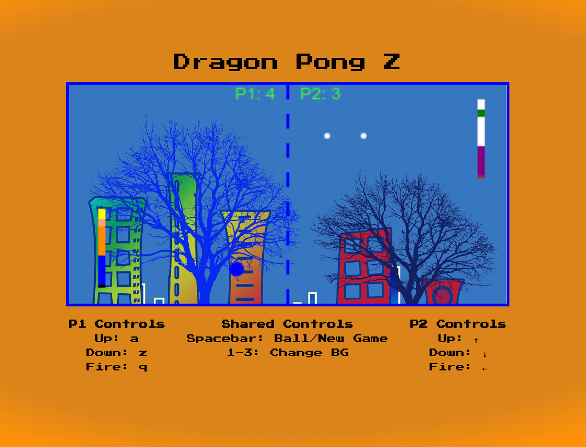

# DRAGON PONG Z!
## Battle to be the pongest being of the universe.

    

---

# Setup / Run Locally
1. Fork or clone the repo
2. Open the terminal and `cd` to the repo directory
3. `> npm i`
4. `> npm start`

 

# Key Bindings

#### Player 1:
* a : up
* z : down
* q : ki blast

#### Player 2:
* ▲ : up
* ▼ : down
* ◄ : ki blast

#### Shared Controls:
* Spacebar : Summon new ball / new game
* #1-3 : Change Background

# How to Play 
##### Move Up and Down to hit the power ball and knock it back towards your enemy. Don't forget to use your ki blast to try and score extra points. Just remember that if the other player hits your ki blast it is removed and you wont get a point.  You will also want to note that due to fatigue your character will begin to slow down as each round progresses so make sure you are getting into position right away.

# Characters
Pongku, Pongolo, Pongza and Majin Poong

# To Do / Implement List
* Add a finite state machine with title screen, character select, game and game over states.
* implement circle collision detection
* use line intersect method for collision
* set up game loop with delta time checks
* increase speed and change the angle of the ball depending on where it collides with a player.
* ability for players to teleport to the top or bottom of the screen (for ki blast masters)
* create my artwork for background and new sound effects

---

Special thanks to [https://pixabay.com](https://pixabay.com) and [https://www.freesound.org/](https://www.freesound.org/) for the free images and sounds released in the Public Domain.

